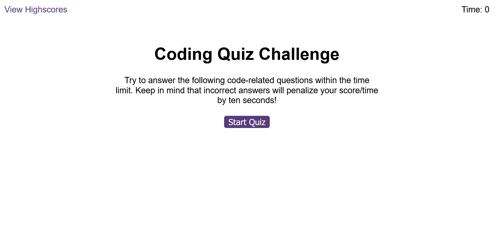
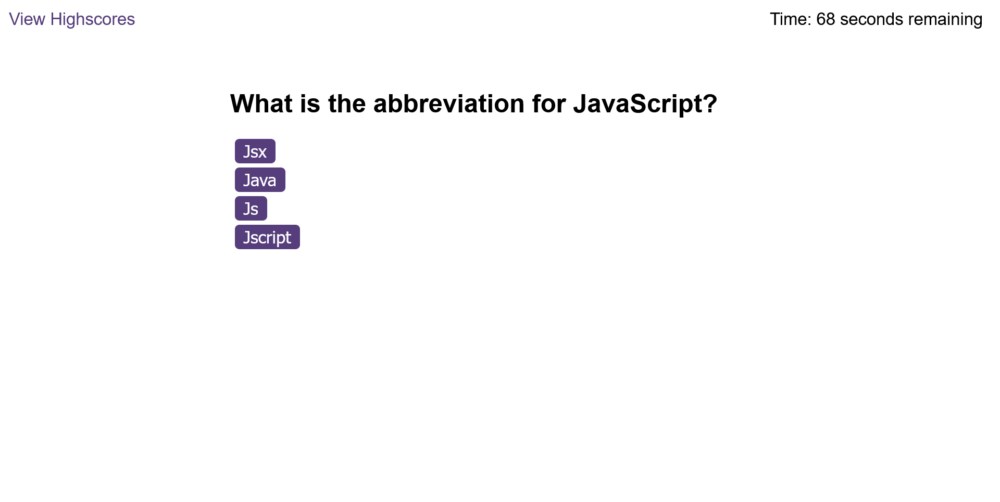
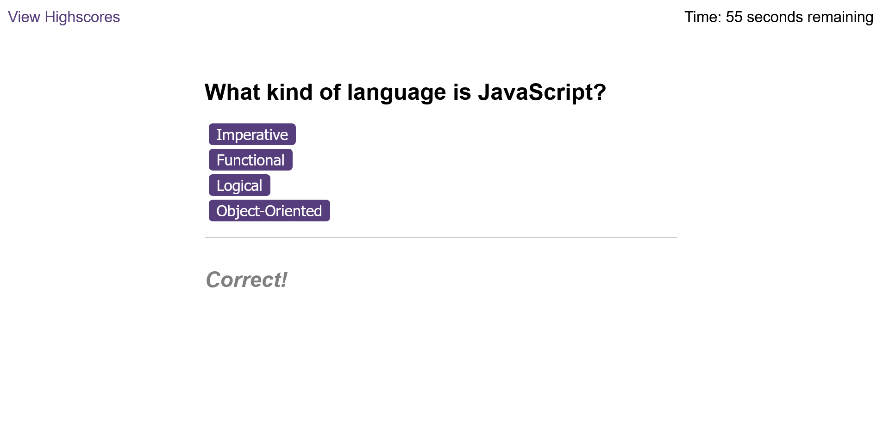
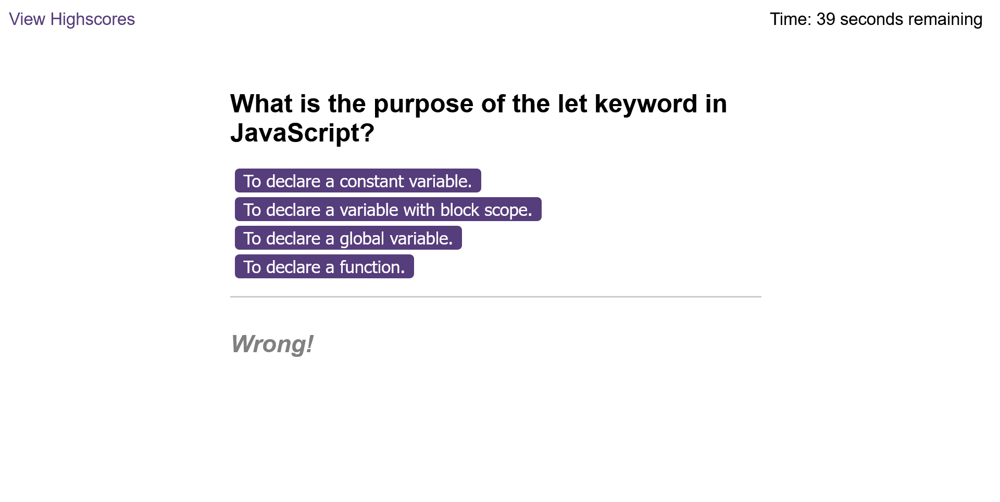
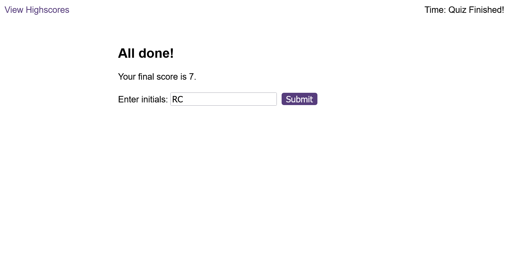
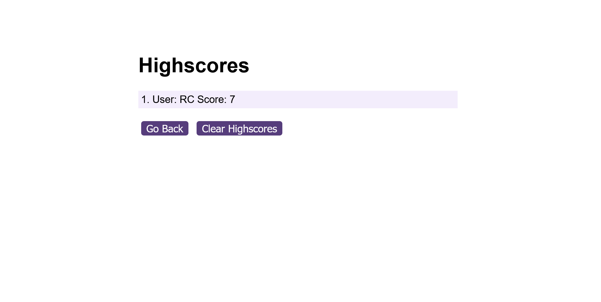

# QuizzyJS 👨‍💻
The official repository of QuizzyJS!

QuizzyJS is an Interactive JavaScript Quiz which is timed and designed to test your knowledge.

## Description

The aim of this project was to build something which would test my own JavaScript skills and let others test theirs at the same time. By building this using JavaScript I've been able to develop my skills and adopt a new mindset when it comes to problem solving.

The problems faced in this project varied from making the application function like an actual quiz, with a timer and a limited amount of questions to, making the application interactive and error free. The solution to the problems throughout this project was a very simple one; writing in-depth pseudocode to breakdown each element of the project one by one, allowing me to work on each part of the applications functionality bit by bit. By breaking down the application into steps, I was able to identify specific functionalities that would make the program work as intended - the choice was to use functions.

Overall, this project has been great to work on and I've learnt alot from developing this.

## Table of Contents

- [Description](#description)
- [Installation](#installation)
- [Credits](#credits)
- [License](#license)

## Installation

N/A

## Usage

Test your JavaScript knowledge by playing QuizzyJS, a Timed and Interactive JavaScript Quiz - <a href="https://reececorkhill.github.io/Quizzy-JS/"> here</a>!

## Credits

Quizzy-JS was developed by <a href="https://github.com/reececorkhill">reececorkhill</a>.

## License

MIT License

Copyright (c) 2024reececorkhill

Permission is hereby granted, free of charge, to any person obtaining a copy
of this software and associated documentation files (the "Software"), to deal
in the Software without restriction, including without limitation the rights
to use, copy, modify, merge, publish, distribute, sublicense, and/or sell
copies of the Software, and to permit persons to whom the Software is
furnished to do so, subject to the following conditions:

The above copyright notice and this permission notice shall be included in all
copies or substantial portions of the Software.

THE SOFTWARE IS PROVIDED "AS IS", WITHOUT WARRANTY OF ANY KIND, EXPRESS OR
IMPLIED, INCLUDING BUT NOT LIMITED TO THE WARRANTIES OF MERCHANTABILITY,
FITNESS FOR A PARTICULAR PURPOSE AND NONINFRINGEMENT. IN NO EVENT SHALL THE
AUTHORS OR COPYRIGHT HOLDERS BE LIABLE FOR ANY CLAIM, DAMAGES OR OTHER
LIABILITY, WHETHER IN AN ACTION OF CONTRACT, TORT OR OTHERWISE, ARISING FROM,
OUT OF OR IN CONNECTION WITH THE SOFTWARE OR THE USE OR OTHER DEALINGS IN THE
SOFTWARE.
